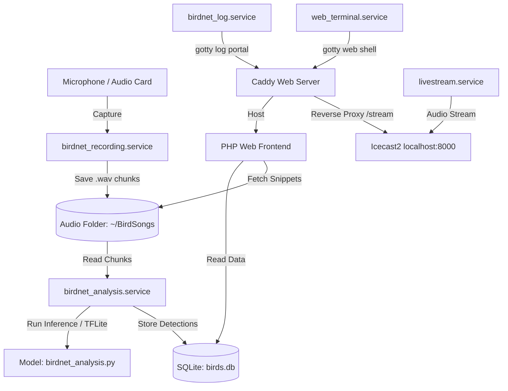

# BirdNET-Pi Workspace Reference Guide

Welcome to the BirdNET-Pi codebase. This document serves as a comprehensive reference guide to help developers and AI assistants navigate the architecture, directory mapping, file locations, and environment setup.

---

## 1. Architectural Overview

BirdNET-Pi is a continuous-recording and classification system that runs on a Raspberry Pi (or 64-bit Debian-based OS) to identify birds by their calls. The architecture is split into two major layers:



*   **Acoustic Recording Engine:** Captures audio snippets through systemd audio services.
*   **TensorFlow Lite Classifier:** Classifies calls in the background using python modules.
*   **Web Portal Interface:** A PHP-based web server (Caddy) serving views and visualizations of local detections.
*   **System Daemons:** Control tools for managing database backups, disk usage, streams, and log outputs.

---

## 2. Directory Structure Map

Below is a breakdown of the primary workspace folders and key files:

*   **[`homepage/`](file:///c:/Users/TroyWisniewski/.gemini/antigravity-ide/scratch/BirdNET-Pi/homepage)**: Frontend UI templates, CSS, and frontend javascript libraries.
    *   **[index.php](file:///c:/Users/TroyWisniewski/.gemini/antigravity-ide/scratch/BirdNET-Pi/homepage/index.php)**: Main frontend entry point containing layout frames and unauthenticated options.
    *   **[views.php](file:///c:/Users/TroyWisniewski/.gemini/antigravity-ide/scratch/BirdNET-Pi/homepage/views.php)**: Master view controller routing content requests (Overview, Tools, Stats, etc.) based on `$_GET['view']`.
    *   **[`static/`](file:///c:/Users/TroyWisniewski/.gemini/antigravity-ide/scratch/BirdNET-Pi/homepage/static)**: Host folder for Javascript dependencies, custom modules, web fonts, and stylesheets.
*   **[`scripts/`](file:///c:/Users/TroyWisniewski/.gemini/antigravity-ide/scratch/BirdNET-Pi/scripts)**: Houses background automation, analysis scripts, installation components, and view helpers.
    *   **[common.php](file:///c:/Users/TroyWisniewski/.gemini/antigravity-ide/scratch/BirdNET-Pi/scripts/common.php)**: Standard include containing common settings, global database query handlers, config parsing, and image fetching logic.
    *   **[config.php](file:///c:/Users/TroyWisniewski/.gemini/antigravity-ide/scratch/BirdNET-Pi/scripts/config.php)**: System configuration forms, settings editor, and updating logic.
    *   **[birdnet_analysis.py](file:///c:/Users/TroyWisniewski/.gemini/antigravity-ide/scratch/BirdNET-Pi/scripts/birdnet_analysis.py)**: The main Python pipeline file matching recording signals to the classifier.
    *   **[install_services.sh](file:///c:/Users/TroyWisniewski/.gemini/antigravity-ide/scratch/BirdNET-Pi/scripts/install_services.sh)**: Provisioning script generating configuration overrides, symlinks, and systemd files.
*   **[`model/`](file:///c:/Users/TroyWisniewski/.gemini/antigravity-ide/scratch/BirdNET-Pi/model)**: Local classifier models (`.tflite`) and language mapping localization dictionaries.
*   **[`templates/`](file:///c:/Users/TroyWisniewski/.gemini/antigravity-ide/scratch/BirdNET-Pi/templates)**: Configuration overrides, shell templates, and cron schedules.

---

## 3. Web Views & JavaScript Mappings

Frontend UI functions link to external dependencies or helper scripts mapping directly back to back-end modules:

| Script Path | Role / Visual Element | PHP Implementation Files |
| :--- | :--- | :--- |
| **[plupload.full.min.js](file:///c:/Users/TroyWisniewski/.gemini/antigravity-ide/scratch/BirdNET-Pi/homepage/static/plupload.full.min.js)** | Plupload framework handling manual sound uploads. | [views.php](file:///c:/Users/TroyWisniewski/.gemini/antigravity-ide/scratch/BirdNET-Pi/homepage/views.php#L76) |
| **[custom-audio-player.js](file:///c:/Users/TroyWisniewski/.gemini/antigravity-ide/scratch/BirdNET-Pi/homepage/static/custom-audio-player.js)** | Standard player element supporting customized styling. | [overview.php](file:///c:/Users/TroyWisniewski/.gemini/antigravity-ide/scratch/BirdNET-Pi/scripts/overview.php#L602)<br>[play.php](file:///c:/Users/TroyWisniewski/.gemini/antigravity-ide/scratch/BirdNET-Pi/scripts/play.php#L170)<br>[todays_detections.php](file:///c:/Users/TroyWisniewski/.gemini/antigravity-ide/scratch/BirdNET-Pi/scripts/todays_detections.php#L555) |
| **[generateMiniGraph.js](file:///c:/Users/TroyWisniewski/.gemini/antigravity-ide/scratch/BirdNET-Pi/homepage/static/generateMiniGraph.js)** | Compiles micro inline graphs showing day-to-day species occurrences. | [overview.php](file:///c:/Users/TroyWisniewski/.gemini/antigravity-ide/scratch/BirdNET-Pi/scripts/overview.php#L603)<br>[todays_detections.php](file:///c:/Users/TroyWisniewski/.gemini/antigravity-ide/scratch/BirdNET-Pi/scripts/todays_detections.php#L556)<br>[species_tools.php](file:///c:/Users/TroyWisniewski/.gemini/antigravity-ide/scratch/BirdNET-Pi/scripts/species_tools.php#L253) |
| **[Chart.bundle.js](file:///c:/Users/TroyWisniewski/.gemini/antigravity-ide/scratch/BirdNET-Pi/homepage/static/Chart.bundle.js)** | Charts rendering for analytics and detection records. | [overview.php](file:///c:/Users/TroyWisniewski/.gemini/antigravity-ide/scratch/BirdNET-Pi/scripts/overview.php#L232)<br>[todays_detections.php](file:///c:/Users/TroyWisniewski/.gemini/antigravity-ide/scratch/BirdNET-Pi/scripts/todays_detections.php#L330)<br>[species_tools.php](file:///c:/Users/TroyWisniewski/.gemini/antigravity-ide/scratch/BirdNET-Pi/scripts/species_tools.php#L252) |
| **[chartjs-plugin-trendline.min.js](file:///c:/Users/TroyWisniewski/.gemini/antigravity-ide/scratch/BirdNET-Pi/homepage/static/chartjs-plugin-trendline.min.js)** | Draws linear trends across dynamic dashboard data charts. | [overview.php](file:///c:/Users/TroyWisniewski/.gemini/antigravity-ide/scratch/BirdNET-Pi/scripts/overview.php#L233)<br>[todays_detections.php](file:///c:/Users/TroyWisniewski/.gemini/antigravity-ide/scratch/BirdNET-Pi/scripts/todays_detections.php#L331) |
| **[dialog-polyfill.js](file:///c:/Users/TroyWisniewski/.gemini/antigravity-ide/scratch/BirdNET-Pi/homepage/static/dialog-polyfill.js)** | Support shim for standard HTML5 dialog dialog elements. | [config.php](file:///c:/Users/TroyWisniewski/.gemini/antigravity-ide/scratch/BirdNET-Pi/scripts/config.php#L291)<br>[history.php](file:///c:/Users/TroyWisniewski/.gemini/antigravity-ide/scratch/BirdNET-Pi/scripts/history.php#L83)<br>[overview.php](file:///c:/Users/TroyWisniewski/.gemini/antigravity-ide/scratch/BirdNET-Pi/scripts/overview.php#L231)<br>[stats.php](file:///c:/Users/TroyWisniewski/.gemini/antigravity-ide/scratch/BirdNET-Pi/scripts/stats.php#L106)<br>[todays_detections.php](file:///c:/Users/TroyWisniewski/.gemini/antigravity-ide/scratch/BirdNET-Pi/scripts/todays_detections.php#L329) |

---

## 4. Configuration & Environment Reference

### Key Configurations
*   **System configuration file:** `/etc/birdnet/birdnet.conf` (linked to `~/BirdNET-Pi/birdnet.conf`). Contains coordinate setups, passwords, network URLs, model details, apprise settings, and directory references.
*   **Caddy Routing Server:** `/etc/caddy/Caddyfile`. Translates incoming HTTP requests into views/proxies, handles FastCGI bindings, and configures Basic Auth requirements.
*   **Python Virtual Environment:** Located at `~/BirdNET-Pi/birdnet/` utilizing resources defined in [requirements.txt](file:///c:/Users/TroyWisniewski/.gemini/antigravity-ide/scratch/BirdNET-Pi/requirements.txt).

### Database References
*   **Detections database (`birds.db`)**: Placed in `./scripts/birds.db`. Schema houses detection tables.
*   **Image Caches (`flickr.db`, `wikipedia.db`)**: Local cache database targets storing references matching scientific names to web picture urls.

### Core Systemd Services
*   `birdnet_analysis.service`: classified detections runner.
*   `birdnet_recording.service`: dynamic audio recording capture.
*   `birdnet_stats.service`: Streamlit frontend server daemon.
*   `spectrogram_viewer.service`: generates spectrogram imagery from stream audio chunks.
*   `chart_viewer.service`: auto-renders detection graphs.
*   `livestream.service`: launches audio stream encoding output.

---

## 5. Developer Cheat Sheet

*   **Checking System Service Status:**
    ```bash
    sudo systemctl status birdnet_analysis.service
    sudo systemctl status birdnet_recording.service
    sudo systemctl status caddy
    ```
*   **Viewing Logs:**
    *   Analysis log (Python): `journalctl -u birdnet_analysis.service -f`
    *   Web Server log: `journalctl -u caddy -f`
*   **Manually Triggering Database Creation:**
    ```bash
    ~/BirdNET-Pi/scripts/createdb.sh
    ```

---

## 6. Git Workflow & Version Control Guide

To establish professional version control habits, we follow a strict, "by-the-book" Git workflow for all changes.

### A. Core Workflow Rules
1. **Never commit directly to main/master:** Always create a feature or bugfix branch.
2. **Explain before branch creation:** Before running `checkout -b`, we explain *why* the branch is being created, what files it targets, and its goal.
3. **Write detailed commit messages:** Commit descriptions must clearly summarize the *what* and *why* of the changes.
4. **Pull/Merge requests:** All merges and pushes will feature a detailed write-up detailing the impact and verification steps.

### B. Standard Command Cheat Sheet

#### 1. Synchronize Main Branch
Before starting new work, always bring the local main branch up to date:
```bash
git checkout main
git pull origin main
```

#### 2. Create a Feature/Bugfix Branch
Use descriptive prefixes like `feature/` or `bugfix/`:
```bash
git checkout -b feature/your-feature-name
```

#### 3. Stage and Commit Changes
Verify which files are modified before staging, and write descriptive commit messages:
```bash
# Check status of modified files
git status

# Stage specific files
git add path/to/file.php

# Commit changes
git commit -m "feat: add detailed description of what is changed and why"
```

#### 4. Push Branch to Remote
Publish the branch to the remote repository so it can be reviewed:
```bash
git push -u origin feature/your-feature-name
```

#### 5. Clean Up After Merge
Once the pull request is merged into main:
```bash
# Switch back to main
git checkout main

# Pull latest merged changes
git pull origin main

# Delete the local branch
git branch -d feature/your-feature-name
```

